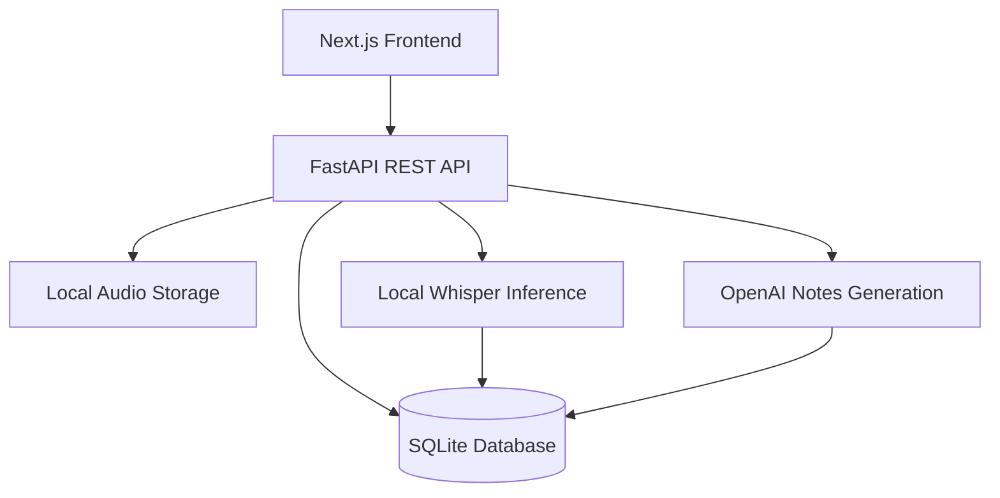

# ClearNote AI

ClearNote AI is an end-to-end audio transcription and structured note-generation application. Users can upload an audio recording, transcribe it locally with OpenAI Whisper, generate structured notes with an OpenAI language model, and view previously uploaded recordings from a persistent dashboard.

The project is being built as a production-oriented AI engineering portfolio project, with clear boundaries between file storage, transcription, note generation, persistence, API delivery, and the user interface.

## Current Status

| Area | Status |
| --- | --- |
| Recording upload and storage | Complete |
| Recording list, retrieval, and deletion | Complete |
| Local Whisper transcription | Complete |
| Transcript persistence | Complete |
| Structured AI note generation | Complete |
| Generated-note persistence | Complete |
| Prompt version tracking | Complete |
| Next.js upload and processing workflow | Complete |
| Recording history dashboard | Complete |
| Reopen saved recordings from history | Next |
| Document ingestion and RAG | Planned |

## Application Workflow

1. A user selects a supported audio file in the frontend.
2. The frontend uploads the file to the FastAPI backend.
3. The backend validates the file, stores it locally, and creates a recording record in SQLite.
4. The user starts transcription.
5. Whisper processes the stored audio locally and the transcript is saved in the database.
6. The user requests structured notes.
7. The transcript is sent to the configured OpenAI model.
8. The generated notes, model name, and prompt version are saved.
9. The frontend displays the transcript and structured notes.
10. The recording appears in the history dashboard with its current processing status.

## Architecture



The backend separates the main responsibilities into API routes, database models, request and response schemas, audio storage, transcription, and AI note-generation services. This keeps the current MVP simple while allowing individual components to be replaced later with object storage, background workers, PostgreSQL, or other production services.

## Technology Stack

### Backend

- Python 3.11
- FastAPI
- SQLAlchemy
- SQLite with `aiosqlite`
- Alembic database migrations
- Pydantic settings
- OpenAI Whisper
- FFmpeg
- OpenAI API
- Pytest

### Frontend

- Next.js
- React
- TypeScript
- Tailwind CSS
- Indigo and slate visual theme

## Project Structure

```text
clearnote-ai/
├── backend/
│   ├── app/
│   │   ├── api/
│   │   │   └── routes/
│   │   │       ├── notes.py
│   │   │       ├── recordings.py
│   │   │       └── transcriptions.py
│   │   ├── core/
│   │   │   ├── config.py
│   │   │   └── database.py
│   │   ├── models/
│   │   │   ├── base.py
│   │   │   ├── generated_note.py
│   │   │   ├── recording.py
│   │   │   └── transcript.py
│   │   ├── schemas/
│   │   │   ├── generated_note.py
│   │   │   ├── recording.py
│   │   │   └── transcript.py
│   │   ├── services/
│   │   │   ├── ai_notes.py
│   │   │   ├── audio_storage.py
│   │   │   ├── generated_notes.py
│   │   │   └── transcription.py
│   │   └── main.py
│   ├── migrations/
│   ├── tests/
│   ├── .env.example
│   └── requirements.txt
├── frontend/
│   ├── src/
│   │   └── app/
│   │       └── page.tsx
│   ├── public/
│   ├── .env.local.example
│   └── package.json
├── .gitignore
└── README.md
```

## Prerequisites

Install the following before running the application:

- Python 3.11
- Node.js and npm
- FFmpeg
- An OpenAI API key for structured note generation

Verify the installations:

```bash
python3.11 --version
node --version
npm --version
ffmpeg -version
```

On macOS, FFmpeg can be installed with Homebrew:

```bash
brew install ffmpeg
```

On Ubuntu or Debian:

```bash
sudo apt update
sudo apt install ffmpeg
```

## Backend Setup

From the project root:

```bash
cd backend
python3.11 -m venv .venv
source .venv/bin/activate
python -m pip install --upgrade pip
python -m pip install -r requirements.txt
cp .env.example .env
```

On Windows PowerShell, activate the virtual environment with:

```powershell
.venv\Scripts\Activate.ps1
```

Update `backend/.env` with your local configuration:

```env
DATABASE_URL=sqlite+aiosqlite:///./clearnote.db
WHISPER_MODEL_NAME=tiny
WHISPER_DEVICE=cpu
OPENAI_API_KEY=your_openai_api_key
OPENAI_MODEL=gpt-5-mini
```

Apply the database migrations:

```bash
python -m alembic upgrade head
```

Start the backend development server:

```bash
python -m fastapi dev app/main.py
```

The backend will be available at:

- API: `http://localhost:8000`
- Interactive API documentation: `http://localhost:8000/docs`
- Alternative API documentation: `http://localhost:8000/redoc`

## Frontend Setup

Open a second terminal from the project root:

```bash
cd frontend
npm install
cp .env.local.example .env.local
```

Set the backend URL in `frontend/.env.local`:

```env
NEXT_PUBLIC_API_BASE_URL=http://localhost:8000
```

Start the frontend development server:

```bash
npm run dev
```

Open `http://localhost:3000` in your browser.

To create a production frontend build:

```bash
npm run build
npm start
```

## Database Design

ClearNote AI currently uses SQLite for local development and SQLAlchemy for persistence.

### `recordings`

Stores the uploaded recording's UUID, original filename, stored filename or path, content type, file size, processing status, and timestamps.

### `transcripts`

Stores one transcript per recording. Important data includes:

- UUID primary key
- Unique `recording_id` foreign key
- Transcript text
- Detected language
- Whisper model name
- Audio duration
- Processing duration
- Creation timestamp

Deleting a recording also deletes its transcript through the configured cascade relationship.

### `transcript_segments`

Stores timestamped Whisper segments associated with a transcript, including segment order, start and end times, text, average log probability, and no-speech probability.

### `generated_notes`

Stores one generated note for a transcript. The persisted data includes the structured note content, OpenAI model name, prompt version, and creation timestamp. Structured list fields are serialized for SQLite storage and converted back into API response objects.

## API Endpoints

| Method | Endpoint | Purpose |
| --- | --- | --- |
| `GET` | `/health` | Verify that the API is running |
| `POST` | `/api/recordings` | Upload and create a recording |
| `GET` | `/api/recordings` | List saved recordings |
| `GET` | `/api/recordings/{recording_id}` | Retrieve one recording |
| `DELETE` | `/api/recordings/{recording_id}` | Delete a recording and related data |
| `POST` | `/api/recordings/{recording_id}/transcribe` | Transcribe a saved recording |
| `GET` | `/api/recordings/{recording_id}/transcript` | Retrieve the saved transcript |
| `POST` | `/api/recordings/{recording_id}/generate-notes` | Generate structured notes |
| `GET` | `/api/recordings/{recording_id}/notes` | Retrieve saved structured notes |

### Recording List Response

The recording-list endpoint returns an object containing an `items` array:

```json
{
  "items": []
}
```

The frontend must read `response.items`; the response itself is not an array.

### Upload a Recording

```bash
curl -X POST \
  "http://localhost:8000/api/recordings" \
  -H "accept: application/json" \
  -H "Content-Type: multipart/form-data" \
  -F "file=@sample.mp3;type=audio/mpeg"
```

### Transcribe a Recording

```bash
curl -X POST \
  "http://localhost:8000/api/recordings/RECORDING_ID/transcribe" \
  -H "accept: application/json"
```

### Generate Structured Notes

```bash
curl -X POST \
  "http://localhost:8000/api/recordings/RECORDING_ID/generate-notes" \
  -H "accept: application/json"
```

Replace `RECORDING_ID` with the UUID returned by the upload endpoint.

## Supported Audio Types

The upload API currently accepts the following MIME types:

- `audio/mpeg`
- `audio/mp4`
- `audio/x-m4a`
- `audio/wav`
- `audio/x-wav`
- `audio/webm`

Files with unsupported content types are rejected with a clear validation error.

When using `curl`, explicitly providing the correct MIME type may be necessary. Otherwise, the file may be submitted as `application/octet-stream` and rejected.

## Transcription

Transcription runs locally with Whisper rather than sending audio to an external transcription API.

The default development configuration uses:

```env
WHISPER_MODEL_NAME=tiny
WHISPER_DEVICE=cpu
```

The `tiny` model keeps local development fast and lightweight. A larger Whisper model can improve transcription quality at the cost of additional memory and processing time.

Transcription results are stored so repeated `GET` requests do not rerun Whisper. The API also prevents accidental duplicate transcript creation for the same recording.

## Structured AI Notes

After transcription, ClearNote AI sends the saved transcript to the configured OpenAI model. The response is converted into structured note data and saved in the database.

The note-generation flow:

1. Validates that the recording exists.
2. Validates that a transcript exists.
3. Checks whether notes have already been generated.
4. Builds the request using the current versioned prompt.
5. Calls the configured OpenAI model.
6. Validates and normalizes the structured response.
7. Saves the note, model name, and prompt version.
8. Returns the persisted note through the API.

Keeping note generation separate from transcription allows either AI component to change without rewriting the complete workflow.

## Prompt Version Tracking

Every generated note stores the prompt version used to create it.

Prompt version tracking is important because changing the prompt can change the format, completeness, tone, or accuracy of generated notes even when the transcript and model remain the same. Recording the version makes an output reproducible and auditable.

For example:

```text
prompt_version = v1
model_name = gpt-5-mini
```

If the prompt later changes to `v2`, old notes remain associated with `v1`. This makes it possible to compare prompt behavior, investigate inconsistent results, and intentionally regenerate notes when a newer prompt is introduced.

## Frontend Dashboard

The Next.js frontend currently supports:

- Audio file selection
- File upload
- Local Whisper transcription
- Structured note generation
- Processing and error messages
- Transcript display
- Structured-note display
- Persistent recording history loaded from the backend
- Status badges showing recording progress
- Immediate history updates after a successful upload or processing step
- Responsive indigo and slate interface

The dashboard reloads saved recording metadata after a browser refresh. The next frontend feature is selecting a historical recording and restoring its saved transcript and notes into the main workspace without rerunning transcription or note generation.

## Error Handling

The API provides explicit errors for common failure cases, including:

- Unsupported audio type
- Missing recording
- Missing transcript
- Missing generated note
- Duplicate transcription requests
- Duplicate note-generation requests
- Invalid or incomplete model output
- Missing OpenAI configuration
- File-system or database failures

The frontend converts backend failures into readable user-facing messages instead of exposing raw exceptions.

## Running Tests

From the `backend` directory:

```bash
source .venv/bin/activate
pytest -v
```

The test suite covers the core recording lifecycle, validation, missing-resource responses, transcription behavior, note-generation behavior, persistence, and duplicate protection. External AI calls should be mocked in automated tests so the suite remains fast, deterministic, and does not require paid API requests.

To test a specific file:

```bash
pytest -v tests/test_recordings.py
```

## Current Limitations

- Audio files are stored on the local filesystem.
- SQLite is intended for local development rather than multi-user production workloads.
- Whisper transcription currently runs in the web request instead of a background worker.
- Large audio files may take significant time to process on CPU.
- The frontend loads recording history but does not yet reopen a selected recording.
- Generated notes are not yet editable in the UI.
- Authentication and per-user data isolation are not yet implemented.
- Export formats are not yet implemented.
- Document ingestion and retrieval-augmented generation are not yet implemented.

## Roadmap

### Next: Reopen Historical Recordings

- Make each history item selectable.
- Fetch the selected recording's saved transcript.
- Fetch its saved structured notes when available.
- Restore the saved content into the main workspace.
- Avoid rerunning completed processing steps.

### Processing Experience

- Improve loading states and step-level progress indicators.
- Disable actions while a request is active.
- Add clearer retry behavior for recoverable failures.
- Display processing duration and additional recording metadata.

### Human Review and Export

- Allow users to edit generated notes.
- Track human-reviewed content separately from the original AI output.
- Export transcripts and notes to Markdown, text, or PDF.

### Document Ingestion and RAG

- Upload reference documents.
- Extract and chunk document content.
- Generate and store embeddings.
- Ask questions across saved documents and transcripts.
- Return citations with answers.
- Detect and communicate insufficient evidence rather than inventing an answer.

### Production Readiness

- Replace local audio storage with object storage.
- Replace SQLite with PostgreSQL.
- Move transcription and note generation to background workers.
- Add authentication and authorization.
- Add per-user ownership and data isolation.
- Add structured logging, metrics, tracing, and operational alerts.
- Add containerized deployment and CI/CD.
- Add retention and deletion controls for sensitive recordings.

## Security and Privacy

ClearNote AI is currently a development and portfolio project. It is not yet intended for production use with protected health information, confidential business recordings, or other sensitive data.

Before production use, the application would require authentication, authorization, encryption, secure object storage, secret management, audit logging, retention controls, data-deletion workflows, provider security review, and appropriate regulatory controls.

Never commit real API keys, `.env` files, uploaded recordings, transcripts containing sensitive information, or local database files.

## Files Excluded from Git

The repository should exclude local and generated files such as:

```text
.env
.env.local
.venv/
__pycache__/
.pytest_cache/
*.db
uploads/
node_modules/
.next/
```

## License

Copyright (c) 2026 Vijay Karingula. All rights reserved.

This repository is publicly viewable for demonstration and portfolio purposes only. No permission is granted to copy, modify, distribute, sublicense, sell, or use this software or its source code without prior written permission from the copyright holder.
